# Овчинников Всеволод БПИ219

## Домашнее задание #4

## Вариант 8

Разработка многопоточного приложения.

### Задача

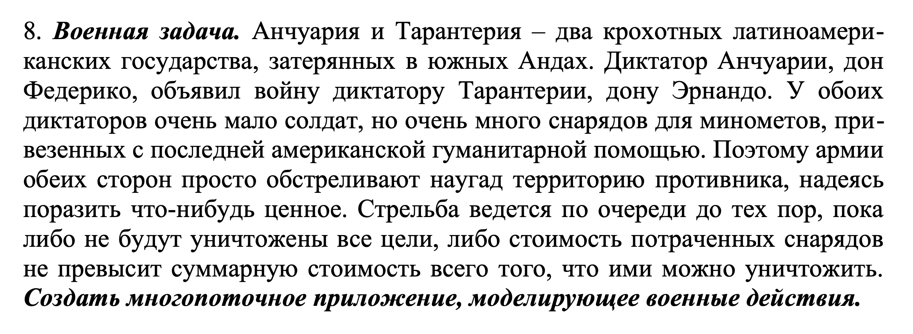

---

### Критерии

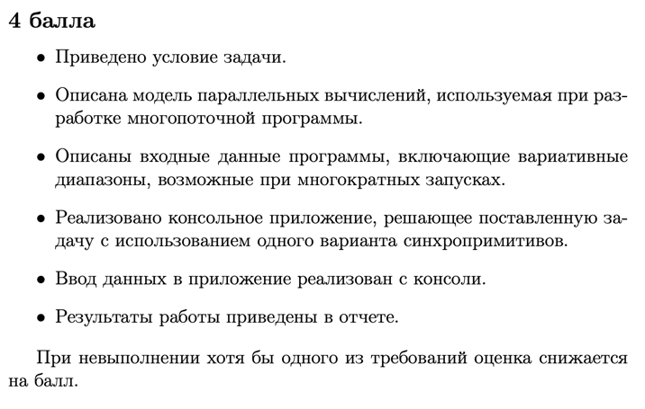

---

- [x] Приведено условие задачи
- [x] Описана модель параллельных вычислений, используемая при разработке многопоточной программы.

В целом модель параллельных вычислений отсутствует при решении данной задачи, так как страны стреляют по очереди.
- [x] Описаны входные данные программы, включающие вариативные диапазоны, возможные при многократных запусках.

При выборе режима требуется ввести

`SIZE` - длина по оси X и Y поля каждой страны

`AMMO_VALUE` - стоимость патрона (от 1 до 9)

`MIN_VALUE` - минимальная ценность клетки поля (от 1 до 8), но меньше `MAX_VALUE`

`MAX_VALUE` - максимальная ценность клетки поля (от 1 до 9), но больше `MIN_VALUE`

`PROBABILITY_DIVISOR` - число, на которое делится 1, для получения вероятности генерации поля с ценным грузом

- [x] Реализовано консольное приложение, решающее поставленную задачу с использованием одного варианта синхропримитивов.
  `main.cpp`
- [x] Ввод данных в приложение реализован с консоли.
- [x] Результаты работы приведены в отчете.

---

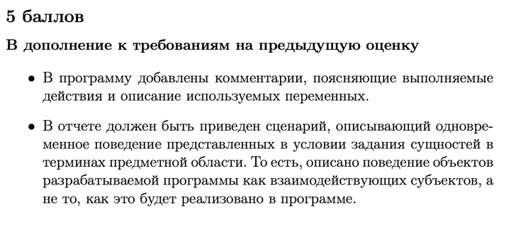

- [x] В программу добавлены комментарии, поясняющие выполняемые действия и описание используемых переменных.
- [x] В отчете должен быть приведен сценарий, описывающий одновременное поведение представленных в условии задания
  сущностей в терминах предметной области. То есть, описано поведение объектов разрабатываемой программы как
  взаимодействующих субъектов, а не то, как это будет реализовано в программе. 
Программа моделирует боевые действия двух стран: они по очереди стреляют по вражеской территории случайным образом.
Пользователю выводится статистика боя
---

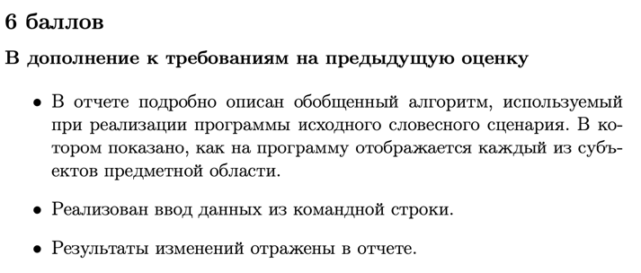

- [x] В отчете подробно описан обобщенный алгоритм, используемый при реализации программы исходного словесного сценария.
  В котором показано, как на программу отображается каждый из субъектов предметной области.
- в программе используется 2 потока, которые переключаются между собой, корректность работы потоков регулируют мютексы.
  (Поток = страна из описания)
  В каждом проверяется состояние победы / поражения каждой страны
- Каждый поток генерирует координаты клетки случайным образом и совершает выстрел.
- [x] Реализован ввод данных из командной строки.
  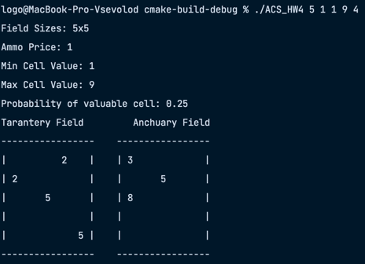
- [x] Результаты изменений отражены в отчете.

---

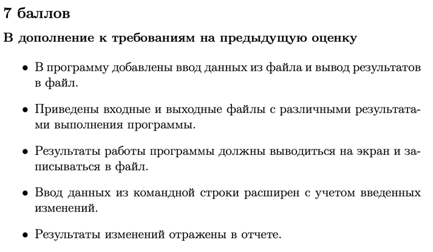

- [x] В программу добавлены ввод данных из файла и вывод результатов в файл.
- [x] Приведены входные и выходные файлы с различными результатами выполнения программы.
  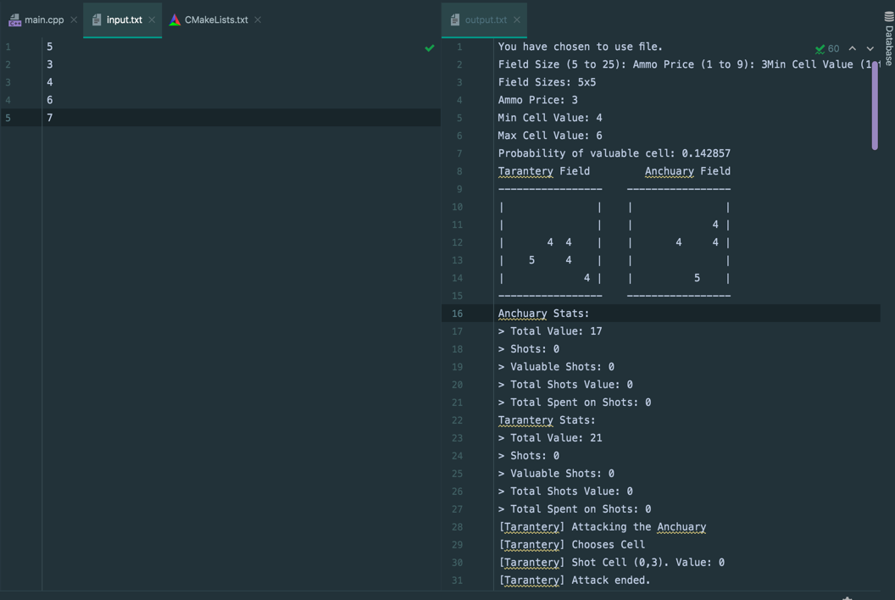
  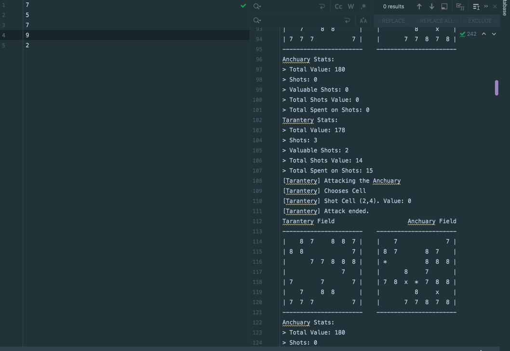
- [x] Результаты работы программы должны выводиться на экран и записываться в файл.
- [x] Ввод данных из командной строки расширен с учетом введенных изменений.
- [x] Результаты изменений отражены в отчете.

---

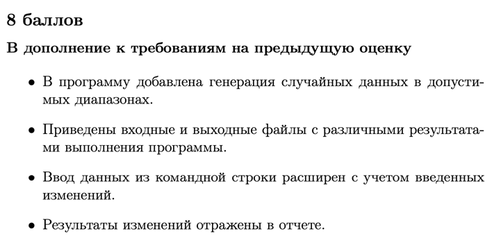

- [x] В программу добавлена генерация случайных данных в допустимых диапазонах.
- [x] Приведены входные и выходные файлы с различными результатами выполнения программы.
  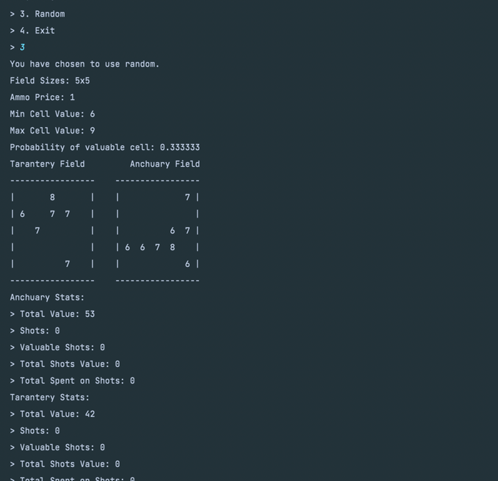
  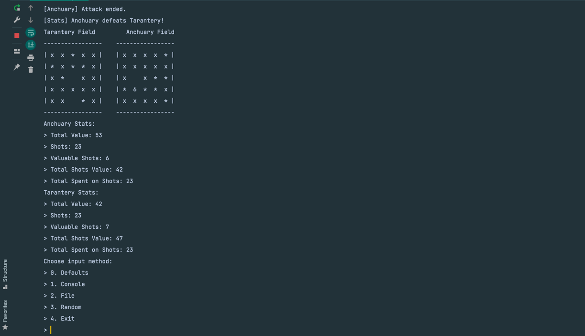
  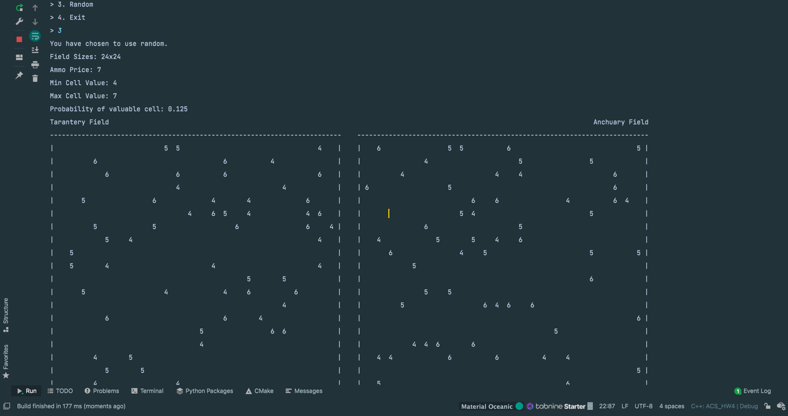
  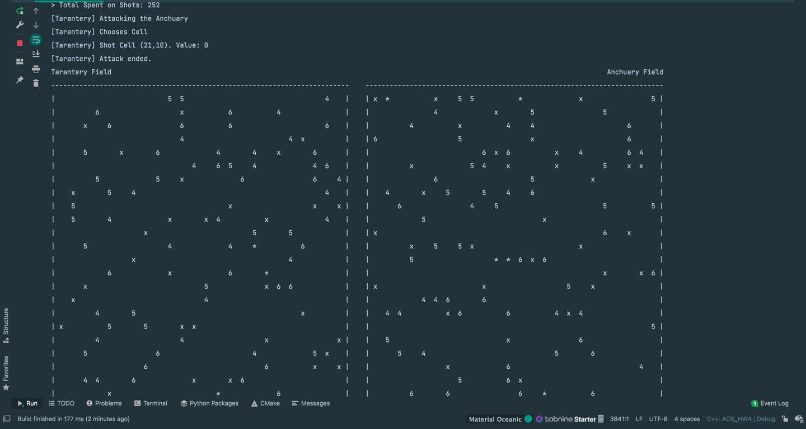
  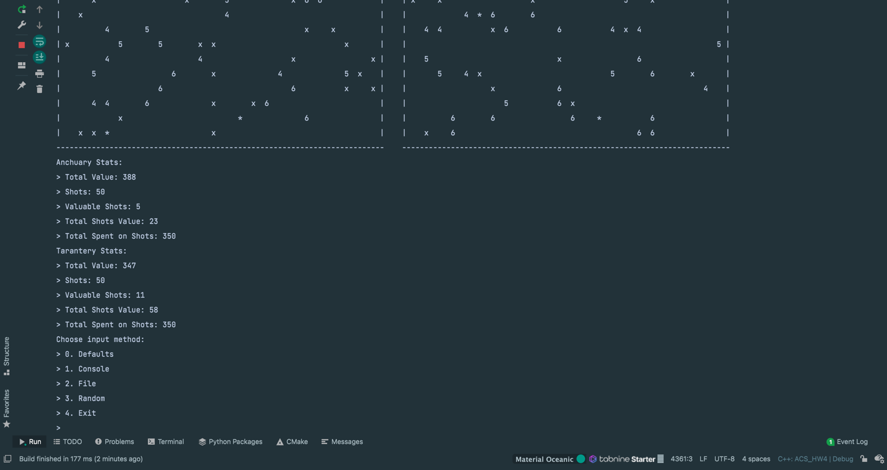
- [x] Ввод данных из командной строки расширен с учетом введенных изменений.
- [x] Результаты изменений отражены в отчете.

---
